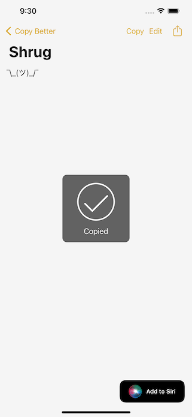
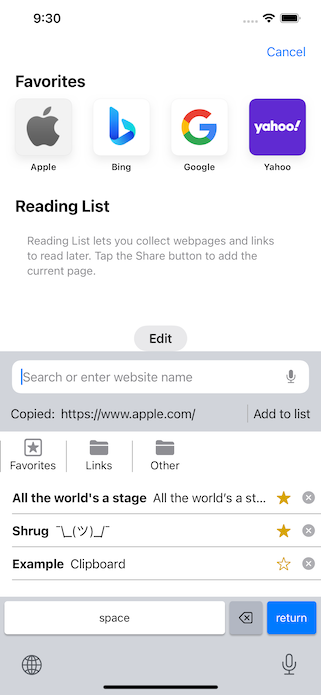

# Copy Better

Copy Better keeps all the things you need to copy and paste in one place, available at a simple tap.

Current version: 2.1 (September 2021)

## Description

- Add clips from the system clipboard, edit them, and create new ones directly in the app. Your clips can be plain text, formatted text, and/or images.
- Create folders to organize your clips, and mark important ones as favorites.
- Add the Favorite Clips widget to your home screen for easy access.
- Use the Copy Better keyboard to paste your clips quickly in other apps.
- Configure Siri shortcuts to create and paste clips anywhere.
- Use the Share extension to save new clips from websites, Photos, or anywhere else with shareable content.

## App Store link

Or direct link: https://apps.apple.com/us/app/copy-better/id1456564050

## Screenshots

  
  
  
  
  
  
  

## Copyright

Copyright © 2021 William Wu. All rights reserved.
