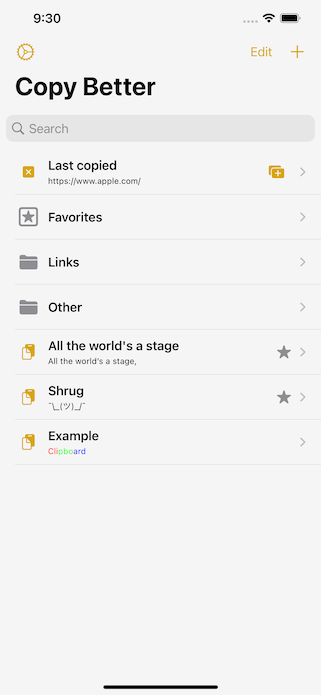
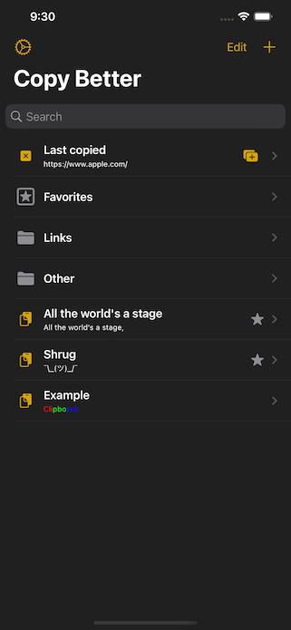
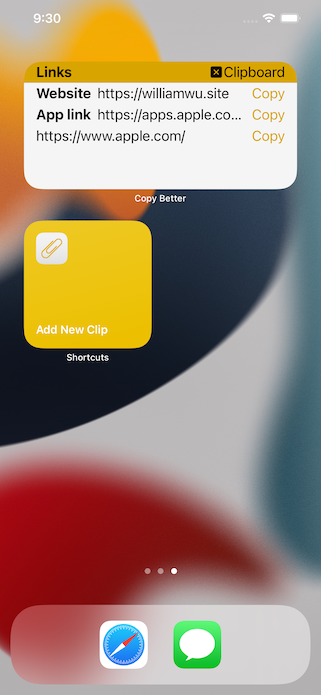

# Copy Better

Juggling between pasting links, images, notes, and text faces? Copy Better makes life a whole lot easier.

## Description

Copy Better keeps all the things you need to copy/paste in one place and available at a simple tap.
- In the app, add clips from the system clipboard, edit them, and create new ones. Your clips can be plain text, formatted text, and/or images.
- From the Today widget, paste a clip without needing to open the app, and add new ones from the system clipboard.
- Through the custom keyboard, insert any of your clips into a text field quickly, without opening up new screens at all, and add clips from the system clipboard.
- With the Share extension, save text or images as new clips from websites, Photos, or anywhere else with shareable content.
- Other features include folders, a Home Screen widget, and the favorites system.

## App Store link

Or direct link: https://apps.apple.com/us/app/copy-better/id1456564050

## Screenshots

